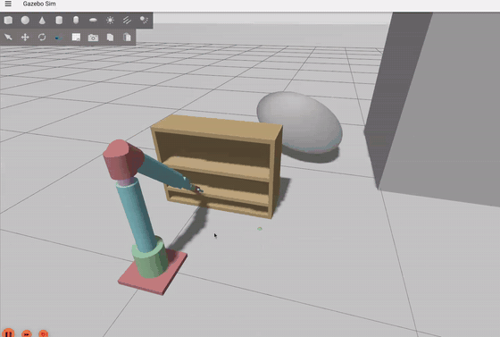

# Robot Motion Planning and Control — Mini-Project

**BGU Course 362-2-5481** | Spring 2026  
**Students:** Etay Baron (209438910) · Roee Zehavi (209146216)  
**Supervisor:** Prof. Amir Shapiro  
**Repository:** <https://github.com/ThEpiCake/Robot_Navigation_and_Control>

---

## Overview

This repository contains both parts of the mini-project:

| Part | Topic | Method |
|------|-------|--------|
| **Part 1** | 6-DOF robotic arm — dynamics, simulation, PID control | Euler-Lagrange · CTC+PID · biRRT · Gazebo |
| **Part 2** | Autonomous drone exploration (GNSS-denied) | FUEL-inspired FIS · Holonomic VFH · 3D A* · OAK-D Lite |

The **final submission document** (report + class presentation + paper copy, single PDF) is in
[`Submission/`](Submission/). The presentation given in class is [`FUEL.pptx`](FUEL.pptx),
and a copy of the selected paper (Zhou et al., *FUEL*, IEEE RA-L 2021) is included as a PDF
in this folder.
Simulation results and graphs are in [`results/`](results/).

## Demos

| Part 1 — 6-DOF arm (Gazebo, CTC+PID playback) | Part 2 — Autonomous drone exploration (40× timelapse) |
|---|---|
|  |  |

Full videos: [`results/arm_gazebo_demo.mp4`](results/arm_gazebo_demo.mp4) (1:12) ·
[`results/drone_swarm_mission_run.mp4`](results/drone_swarm_mission_run.mp4) (18:25, full mission)

---

## Part 1 — 6-DOF Robotic Arm

### Robot Description

Custom manipulator with joint configuration **R-P-P-R-R-R** (Revolute–Prismatic–Prismatic–Revolute–Revolute–Revolute):

| Joint | Type | Axis | Range |
|-------|------|------|-------|
| θ₁ | Revolute (yaw base) | Z global | ±π |
| d₁ | Prismatic (vertical lift) | Z local | 0 – 0.255 m |
| d₂ | Prismatic (reach), 135° tilt | Z after tilt | 0 – 0.255 m |
| θ₄ | Revolute (wrist Z1) | Z | ±π |
| θ₅ | Revolute (wrist Y) | Y | ±π/2 |
| θ₆ | Revolute (wrist Z2) | Z | ±π |

The **Z-Y-Z spherical wrist** (θ₄, θ₅, θ₆) allows kinematic decoupling between position and orientation.

### Package Structure

```
src/
├── my_robot_description/      # URDF/Xacro model, RViz config
├── my_robot_bringup/          # Gazebo world, launch files, controller bridge
└── my_robot_control/          # All dynamics, control, and planning code
    ├── urdf_params.py         # Physical constants from URDF (masses, inertias, link lengths)
    ├── kinematics.py          # Forward kinematics (⁰T₈) + closed-form IK (Z-Y-Z wrist)
    ├── dynamics.py            # Symbolic M(q), C(q,q̇), G(q) via SymPy + lambdify cache
    ├── integrator.py          # RK4 integrator, energy utilities
    ├── controllers.py         # Computed-Torque PID + quintic trajectory generator
    ├── navigation.py          # biRRT C-space planner + 8-point collision proxy
    ├── simulate_free.py       # Zero-input free response (τ=0), energy conservation check
    ├── simulate_pid.py        # Full CTC+PID shelf A→B demo
    ├── gazebo_control_node.py # ROS 2 node: replays CSV trajectory in Gazebo
    └── plotting.py            # Graph generation utilities
```

### Key Functions

#### `dynamics.py`
| Function | Description |
|----------|-------------|
| `_derive_symbolic()` | Builds full kinematic chain in SymPy, derives M(q), C(q,q̇), G(q) via Euler-Lagrange |
| `_lambdify_all()` | Converts symbolic expressions → fast NumPy functions (CSE optimization) |
| `load_dynamics()` | Loads cached matrices; re-derives only if cache missing |

#### `kinematics.py`
| Function | Description |
|----------|-------------|
| `fk(q)` | Forward kinematics: returns `⁰T₈` (4×4 transform, base → EE) |
| `ik(p, R)` | Inverse kinematics: closed-form solution using wrist decoupling |

#### `controllers.py`
| Function | Description |
|----------|-------------|
| `ComputedTorquePID.step(q, qdot, t)` | Computes τ = M(q)·v + C·q̇ + G; v = q̈_d + Kd·ė + Kp·e + Ki·∫e |
| `quintic_trajectory(q0, qf, T)` | Generates min-jerk 5th-order polynomial: s(t) = a₃t³ + a₄t⁴ + a₅t⁵ |

#### `navigation.py`
| Function | Description |
|----------|-------------|
| `biRRT(q_start, q_goal)` | Bidirectional RRT in C-space; 20% goal bias, 400 shortcut trials |
| `check_clearance(q)` | Computes min distance from 8 arm points to shelf obstacles |
| `repulsive_torque(q, qdot)` | τ_rep = −Σ Jᵢᵀ · ∇U_rep(pᵢ), clamped ±50 N·m |

### Installation & Run — Part 1

**Requirements:** Ubuntu 24.04 · ROS 2 Jazzy · Gazebo Harmonic · Python 3.11 + `numpy scipy sympy matplotlib`

```bash
# Install Python dependencies
pip install numpy scipy sympy matplotlib

# Build ROS 2 workspace (from this course folder)
cd "Master_HW/Robot Navigation and Control"
source /opt/ros/jazzy/setup.bash
colcon build --symlink-install
source install/setup.bash
```

**Run options:**

```bash
# Option A — One-command full demo (recommended)
# Launches Gazebo, generates trajectory, plays back automatically
ros2 launch my_robot_control playback.launch.py

# Option B — Simulation only (no Gazebo), generates graphs to results/
python3 -m my_robot_control.simulate_pid

# Option C — Free response (energy conservation check)
python3 -m my_robot_control.simulate_free

# Option D — Replay existing CSV without re-running simulation
ros2 launch my_robot_control playback.launch.py generate_trajectory:=false

# Option E — Manual two-terminal split
# Terminal 1:
ros2 launch my_robot_bringup my_robot_gazebo.launch.xml
# Terminal 2:
ros2 run my_robot_control gazebo_control --ros-args \
    -p csv_file:=results/pid_trajectory.csv
```

**Force dynamics re-derivation** (takes ~5 min, cached afterwards):
```bash
python3 -m my_robot_control.dynamics
```

### Configuration — Part 1

Edit `src/my_robot_control/config/sim.yaml`:

```yaml
# Pose waypoints (task space, preferred)
pose_waypoints:
  - name: A_shelf1
    position: [0.467, 0.0, 0.133]      # x, y, z [m]
    rpy:      [3.1416, 0.7854, 3.1416] # roll, pitch, yaw [rad]
    duration: 1.5
  - name: B_shelf2
    position: [0.467, 0.0, 0.283]
    rpy:      [3.1416, 0.7854, 3.1416]
    duration: 1.0

# C-space planner
planning:
  enabled: true
  arm_surface_radius: 0.035   # [m]
  max_iters: 5000
  shortcut_trials: 400
```

PID gains: `config/pid_gains.yaml` — tuned for critical damping (ζ=1), ωₙ = [5,4,4,6,6,6] rad/s.

### Part 1 Outputs

| File | Contents |
|------|----------|
| `results/joint_states_pid.png` | q_i(t) desired vs actual |
| `results/tracking_error_pid.png` | Error e_i(t) and torques τ_i(t) |
| `results/ee_path_pid.png` | End-effector path A→B in task space |
| `results/stick_snapshots_pid.png` | Arm posture snapshots |
| `results/clearance_pid.png` | Min arm–shelf clearance over time |
| `results/pid_trajectory.csv` | Joint trajectory for Gazebo replay |
| `results/animation_pid.gif` | Animated stick figure |
| `results/arm_gazebo_demo.mp4` | Screen recording: full playback demo in Gazebo + RViz |
| `results/arm_demo.gif` | Short GIF of the Gazebo demo (embedded above) |

---

## Part 2 — Autonomous Drone Exploration (FUEL-inspired)

### Architecture

GNSS-denied autonomous exploration of a 3-room warehouse environment using a single **Holybro X500** quadrotor in Gazebo Harmonic + PX4 SITL.

**Sensor:** OAK-D Lite stereo depth camera (69.4°×54.4° FOV, 0.1–8.0 m range, 30 Hz) — 2D LiDAR removed.  
**Localization:** PX4 EKF2 (IMU + BaroAlt + Optical Flow) with `slam_to_px4` yaw-gate filtering.

```
OAK-D Lite (30 Hz)
  camera/depth/image_raw ──► voxel_mapper (C++)
                              log-odds 3D · FIS clusters · 3D A*
                              │
                              │ /frontier_path
                              ▼
                     search_mission_controller (C++)
                     FSM · Holonomic VFH (72 sectors) · Yaw slew
                              │
                              │ TrajectorySetpoint (velocity NED + yaw)
                              ▼
                         PX4 EKF2 — Offboard Mode
                              │
                         slam_to_px4.py
                         (yaw-gate hysteresis: 2 bad / 15 good frames)
```

### Package Structure (swarm_project)

```
swarm_project/ros2_ws/src/
├── swarm_bringup/
│   ├── launch/
│   │   └── d1_single_agent_search.launch.py   # Main entry point
│   ├── config/
│   │   └── slam_toolbox_params.yaml
│   └── scripts/
│       ├── slam_to_px4.py          # Yaw-gate filter: SLAM → PX4 EKF2 external vision
│       ├── odom_publisher.py       # TF publisher (map→odom→base_link)
│       ├── lidar_tilt_filter.py    # Floor/ceiling LiDAR hit filter (legacy)
│       └── entropy_centroid_publisher.py
│
├── swarm_perception/
│   └── src/voxel_mapper.cpp        # 3D log-odds mapping + FIS frontiers + A* planner
│
├── swarm_control/
│   └── src/search_mission_controller.cpp  # FSM + holonomic VFH + velocity publisher
│
├── swarm_target_detection/         # HSV red-blob detection on RGB frame
└── swarm_coordination/             # Swarm multi-agent coordination (future)
```

### Key Nodes & Functions

#### `voxel_mapper.cpp` — 3D Mapping + Planning
| Function | Description |
|----------|-------------|
| `integrateDepth()` | Ray-cast depth image → update log-odds per voxel: l_hit=+0.60, l_miss=−0.40 |
| `computeFrontiers()` | BFS scan: free voxels adjacent to unknown = frontier. Groups into FIS clusters (r=1.2 m) |
| `scoreViewpoint(cluster)` | Weighted score: info gain · cluster size · clearance · A* distance · progress · yaw alignment |
| `planAstar()` | 3D A* on 11 altitude layers (1–8 m), 18-connectivity, Voronoi cost 4/d_obs, LoS shortcutting |
| `publishFrontierPath()` | Publishes ~8 waypoints on `/frontier_path` at 2 Hz |

**Key parameters** (set in `d1_single_agent_search.launch.py`):

| Parameter | Value | Notes |
|-----------|-------|-------|
| `log_odds_hit` | 0.60 | 2 hits required before marking occupied |
| `log_odds_miss` | 0.40 | |
| `max_range_m` | 8.0 | Match camera max depth |
| `integrate_lidar_into_map` | false | OAK-D Lite only; LiDAR removed |
| `voxel_size_m` | 0.20 | Grid resolution |

#### `search_mission_controller.cpp` — FSM + Navigation
| Function | Description |
|----------|-------------|
| `compute_vfh()` | Builds 72-sector obstacle histogram from depth ranges; dilates ±3 sectors; returns best open valley direction as `{v_N, v_E}` |
| `slew_yaw_cmd_toward(ψ)` | Rate-limited yaw: `yaw_cmd += clamp(err, ±yaw_rate_limit/hz)` — 30°/s max |
| `publish_velocity_sp(vN, vE, vZ, yaw)` | Sends `TrajectorySetpoint`: velocity NED + absolute yaw; yawspeed=NaN |
| `fsmUpdate()` | State machine tick at 10 Hz; handles all state transitions |

**Mission State Machine:**

```
TAKEOFF_CLIMB ──► TAKEOFF_SETTLE ──► SCAN ◄────────────────────┐
                                       │                         │
                                       │ (target detected)       │ (inspected)
                                       ▼                         │
                                  TARGET_INSPECT ────────────────┘
                                       
                  SCAN ──► (coverage ≥ 82% or no frontiers)
                       ──► RETURN ──► LANDING ──► DONE
```

#### `slam_to_px4.py` — Yaw Gate Filter
| Function | Description |
|----------|-------------|
| `_yaw_check(slam_yaw, px4_yaw)` | Flags bad frames: residual > 0.55 rad OR SLAM jump > 0.25 rad OR rate > 90°/s |
| Hysteresis | Gate activates after 2 bad frames; clears after 15 good frames |
| Fallback | When gated: EKF2 runs IMU-only yaw (max 750 ms → drift < 0.2°) |

### Installation & Run — Part 2

**Requirements:**
- Ubuntu 24.04 · ROS 2 Jazzy · Gazebo Harmonic
- PX4 Autopilot v1.14 (SITL, airframe 4022)
- Micro XRCE-DDS Agent
- Python 3.11 + `numpy pandas matplotlib`

```bash
# 1. Build workspace
cd ~/swarm_project/ros2_ws
source /opt/ros/jazzy/setup.bash
colcon build --symlink-install
source install/setup.bash

# 2. Terminal 1 — Start Micro XRCE-DDS Agent
MicroXRCEAgent udp4 -p 8888

# 3. Terminal 2 — Start PX4 SITL + Gazebo (airframe 4022 = GNSS-denied X500)
cd ~/PX4-Autopilot
make px4_sitl gz_x500

# 4. Terminal 3 — Launch mission
ros2 launch swarm_bringup d1_single_agent_search.launch.py
```

**Or use the convenience script:**
```bash
cd ~/swarm_project/ros2_ws/src/swarm_bringup/scripts
./start_sitl.sh           # starts XRCE agent + PX4 SITL
# then in another terminal:
ros2 launch swarm_bringup d1_single_agent_search.launch.py
```

**Key launch arguments:**
```bash
ros2 launch swarm_bringup d1_single_agent_search.launch.py \
    v_max_mps:=0.7 \
    yaw_rate_limit_dps:=30.0 \
    holonomic_vfh:=true \
    log_odds_hit:=0.60 \
    scan_coverage_fraction:=0.82 \
    takeoff_lookaround_enabled:=False
```

**Generate flight graphs from a recorded bag:**
```bash
cd "Master_HW/Robot Navigation and Control/results"
python3 plot_drone_flight.py       # basic graphs (XY, altitude, VFH heading, sectors)
python3 plot_extra_graphs.py       # additional: 3D trajectory, Gantt, coverage timeline, density map
```

### Part 2 Key Parameters

| Parameter | Value | Effect |
|-----------|-------|--------|
| `v_max_mps` | 0.7 m/s | Max flight speed |
| `yaw_rate_limit_dps` | 30°/s | Max yaw rotation rate |
| `holonomic_vfh` | true | Decouple yaw from movement direction |
| `log_odds_hit` | 0.60 | Require 2 hits before marking occupied |
| `integrate_lidar_into_map` | false | Depth camera only (LiDAR removed) |
| `takeoff_lookaround_enabled` | False | Skip 360° spin at takeoff (was root SLAM drift cause) |
| `scan_coverage_fraction` | 0.82 | Coverage threshold to advance altitude layer |
| `jump_gate_m` | 0.75 | SLAM XY jump gate |
| `yaw_residual_gate_rad` | 0.55 | SLAM yaw drift gate |
| `max_range_m` | 8.0 | Depth camera max range |

### Part 2 Results

| Metric | Value |
|--------|-------|
| Mission duration | ~1068 s (~17.8 min) |
| Area coverage | **69.5%** |
| Targets found | **3 / 3** |
| Altitude layers scanned | 8 (1.0 – 8.0 m) |
| Local minima (VFH escapes) | 0 |
| Offboard errors | 0 |

**Result graphs** (in `results/`):

| File | Contents |
|------|----------|
| `drone_3d_trajectory.png` | 3D N/E/Alt path colored by FSM state |
| `drone_task_xy.png` | Top-down XY trajectory |
| `drone_task_altitude.png` | Altitude vs time (8 scan layers visible) |
| `drone_coverage_timeline.png` | Coverage % over time with state shading |
| `drone_state_gantt.png` | FSM state Gantt chart |
| `drone_exploration_density.png` | XY heatmap + altitude histogram |
| `drone_nav_performance.png` | Distance-to-goal + VFH heading over time |
| `drone_config_heading.png` | VFH heading during SCAN (C-space) |
| `drone_config_sectors.png` | Blocked VFH sectors over time (C-space) |
| `drone_swarm_mission_run.mp4` | Full mission screen recording (18:25) |
| `drone_demo.gif` | 40× timelapse GIF of the mission (embedded above) |

---

## Report & Submission Document

The final submission is a single unified PDF — the full report (Hebrew), with the class
presentation as Appendix A and a copy of the FUEL paper as Appendix B:

[`Submission/Final_Project_Navigation_and_Control_209146216_209438910.pdf`](Submission/Final_Project_Navigation_and_Control_209146216_209438910.pdf)

---

## Repository Layout

```
.
├── Submission/             # Final submission: unified PDF (report + presentation + paper)
├── src/                    # Part 1 ROS 2 packages (my_robot_*)
│   ├── my_robot_description/
│   ├── my_robot_bringup/
│   └── my_robot_control/
├── swarm_project/ros2_ws/src/   # Part 2 ROS 2 packages (swarm_*)
│   ├── swarm_bringup/           # Launch files, mission controller, SLAM→PX4 bridge
│   ├── swarm_sim_bringup/       # Gazebo + PX4 SITL bringup, sensor bridges
│   ├── swarm_perception/        # voxel_mapper: 3D mapping, FIS frontiers, A*
│   ├── swarm_control/
│   ├── swarm_target_detection/  # HSV red-blob target detection
│   ├── swarm_msgs/
│   ├── swarm_gcs/
│   └── swarm_coordination/      # Future multi-agent coordination
├── results/
│   ├── *.png / *.csv       # All graphs and data (Part 1 arm + Part 2 drone)
│   ├── arm_gazebo_demo.mp4 / arm_demo.gif
│   ├── drone_swarm_mission_run.mp4 / drone_demo.gif
│   ├── plot_drone_flight.py
│   └── plot_extra_graphs.py
├── FUEL.pptx               # Presentation given in class (1.7.2026)
└── FUEL- Fast UAV Exploration [...].pdf   # Selected paper (Zhou et al., RA-L 2021)
```

---

## Dependencies Summary

| Component | Version |
|-----------|---------|
| OS | Ubuntu 24.04 LTS |
| ROS 2 | Jazzy Jalisco |
| Gazebo | Harmonic |
| PX4 Autopilot | v1.14 (SITL) |
| Python | 3.11 |
| numpy / scipy / sympy | latest |
| matplotlib / pandas | latest |
| OAK-D Lite SDK | DepthAI 2.x |
